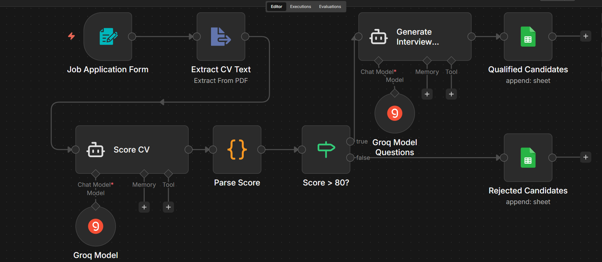
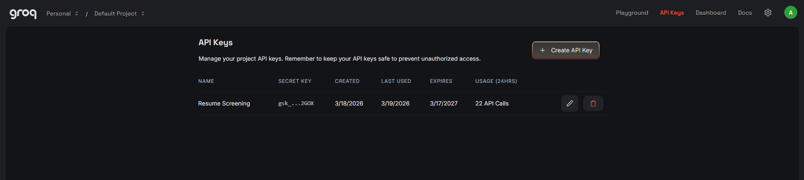
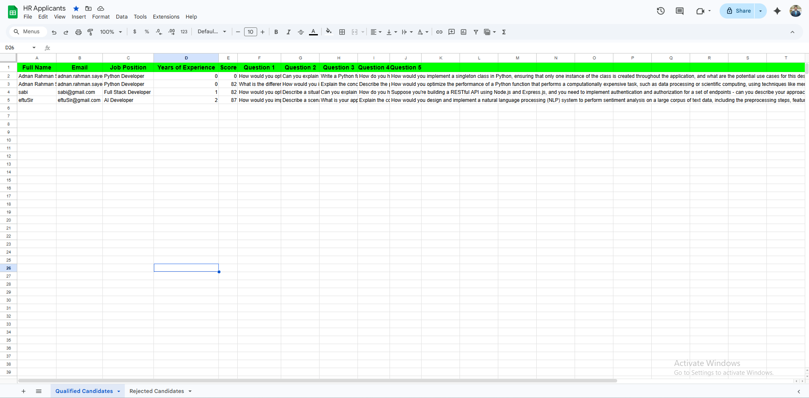
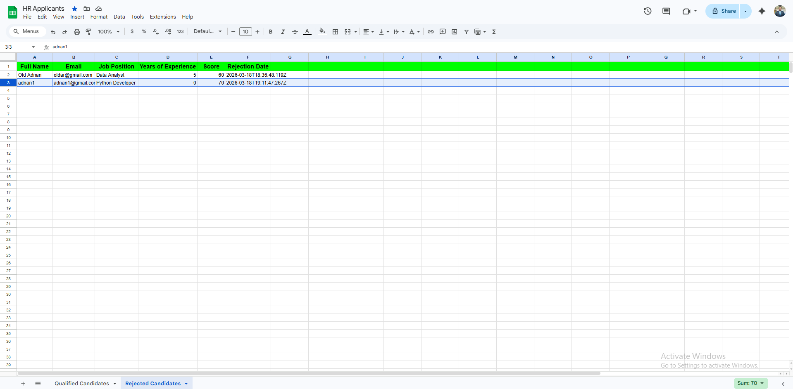

# 🤖 AI-Powered HR Recruitment Agent (n8n + Groq)

> A fully automated recruitment workflow that scores CVs, filters candidates, 
> and generates interview questions — with zero manual effort.

---

## 🎬 Watch the Full Demo

[](https://youtu.be/awP0u0HqAX0)

> 📺 Click the badge above to watch the full walkthrough on YouTube, 
> or [click here](https://youtu.be/awP0u0HqAX0) to go directly to the video.

---

## 🖼️ Workflow Overview



---

## ✨ What It Does

When someone submits a job application through the form, the workflow:

1. Collects applicant info and CV through an automated form
2. Extracts and reads the CV text from the uploaded PDF
3. Uses Groq AI (Llama 3.3) to score the CV out of 100
4. If score > 80 → generates 5 job-specific interview questions and saves to Google Sheets
5. If score ≤ 80 → saves the candidate to a separate Rejected Candidates sheet

No manual work. No CV reading. Just automation.

---

## 🛠️ Built With

| Tool | Purpose |
|---|---|
| [n8n](https://n8n.io) | Workflow automation |
| [Groq API](https://console.groq.com) | AI model (Llama 3.3 70b) |
| Google Sheets | Data storage |

---

## 📋 Prerequisites

Before you start, make sure you have:

- A free [n8n Cloud account](https://n8n.io) or self-hosted n8n
- A free [Groq API key](https://console.groq.com)
- A Google account for Google Sheets

---

## 🚀 How to Set It Up

### Step 1 — Import the Workflow
1. Download the `hr_agent_workflow.json` file from this repo
2. Open your n8n canvas
3. Click the **three dots menu (...)** at the top right
4. Click **"Import"** and select the JSON file
5. Your workflow will appear on the canvas

---

### Step 2 — Add Your Groq API Key



1. Click on the **"Groq Model"** node
2. Click the **pencil icon** next to the Credential field
3. Create a new credential and paste your Groq API key
4. Click **Save**
5. Do the same for the **"Groq Model Questions"** node

---

### Step 3 — Set Up Google Sheets

**Qualified Candidates Sheet:**



Create a sheet with these headers:
```
Full Name | Email | Job Position | Years of Experience | Score | Question 1 | Question 2 | Question 3 | Question 4 | Question 5
```

**Rejected Candidates Sheet:**



Create a sheet with these headers:
```
Full Name | Email | Job Position | Years of Experience | Score | Rejection Date
```

Then in n8n:
1. Click the **"Qualified Candidates"** Google Sheets node
2. Paste your Sheet ID in the Document ID field
3. Connect your Google account via OAuth
4. Do the same for the **"Rejected Candidates"** node

---

### Step 4 — Test It
1. Click the **"Job Application Form"** node
2. Click **"Open Form"**
3. Fill in the form with test data and upload a real PDF CV
4. Watch the workflow run — nodes will turn green one by one
5. Check your Google Sheet for the new row ✅

---

### Step 5 — Go Live
1. Click the **"Inactive"** toggle at the top right of the canvas
2. Turn it **Active** 🟢
3. Share the form URL with your applicants

---

## 📊 How the Scoring Works

The AI evaluates candidates based on:

| Criteria | Description |
|---|---|
| Relevant Experience | Does their experience match the role? |
| Skills | Do they have the technical skills needed? |
| Education | Does their education background fit? |
| Overall Fit | How well do they match the position overall? |

Candidates scoring **above 80** → move forward with 5 custom interview questions
Candidates scoring **80 or below** → saved to the rejected sheet automatically

---

## 📁 Project Structure
```
n8n-ai-hr-agent/
├── assest/
│   ├── groq_API.png
│   ├── n8n_full_workflow.png
│   ├── sheet_qualified_candidates.png
│   └── sheet_rejected_randidates.png
├── hr_agent_workflow.json
└── README.md
```

---

## 🔧 Customization

| What to Change | Where to Change It |
|---|---|
| Score threshold | `Score > 80?` node — change the number |
| Number of questions | Prompt inside `Generate Interview Questions` node |
| Scoring criteria | System Message inside `Score CV` node |

---

## 🙋‍♂️ Author

**Adnan Rahman Sayeem**
[GitHub](https://github.com/ar-sayeem) • [LinkedIn](https://www.linkedin.com/in/adnan-rahman-sayeem/)

---

## 📄 License
This project is licensed under the MIT License — see the [LICENSE](https://github.com/ar-sayeem/n8n-ai-hr-agent/blob/main/LICENSE) file for details.